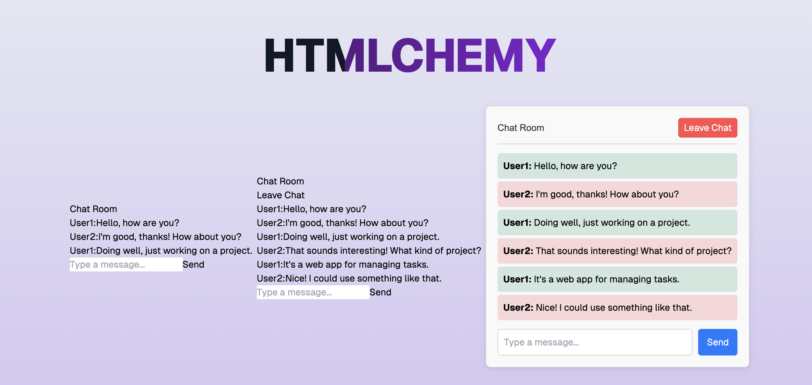

# HTMLchemy

HTMLchemy is a project created during the Agents UX hackathon at the Hillsborough AGI House on September 14, 2024.

Live at https://htmlchemy.com

## Screenshot

## Functionality

Create react components with AI, and breed them with other components to create new versions to your liking.

## Tech Stack

- Next.js
- React
- TypeScript
- Tailwind CSS
- OpenAI API

## Getting Started

1. Clone the repository
2. Install dependencies with `yarn install`
3. Add your OPENAI_API_KEY to the `.env` file
4. Run the development server with `yarn dev`
5. Open [http://localhost:3000](http://localhost:3000) in your browser

## Contributing

Contributions are welcome! Please feel free to submit a Pull Request.

## License

[MIT License](LICENSE)
